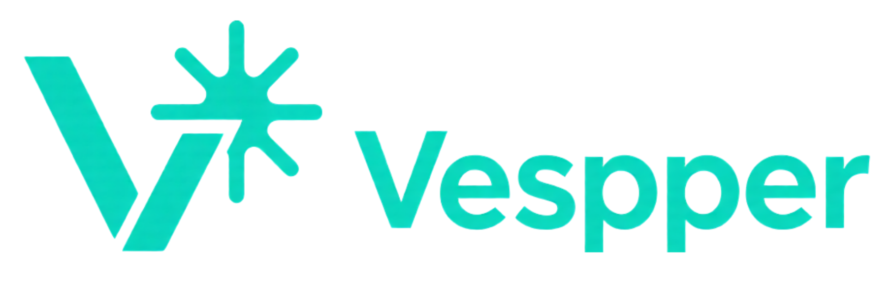
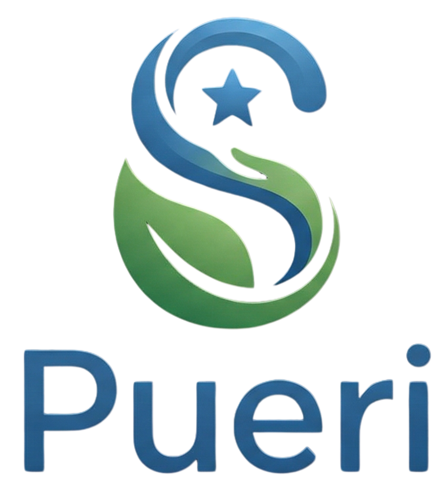

<h1 align="center">Tiago Machado Jardim</h1>

  

  
  
  

## Sobre Mim

Engenheiro de Computação e desenvolvedor Full Stack com experiência em produtos digitais reais para saúde.

- Formado em Análise e Desenvolvimento de Sistemas (UniCesumar)
- Formado em Engenharia de Computação (UNIPAMPA)
- CEO e Fundador da BienTech
- Atuação em arquitetura, desenvolvimento e entrega de plataformas SaaS, apps mobile e portais web

## Conexões

  
  
  
  
  
  

---

## Stack Técnica

  

  

---

## Projetos em Destaque

### Plataformas e produtos

<table>
  <tr>
    <td align="center" width="25%">
      <a href="https://www.bientech.com.br" target="_blank">
         
        React, Bootstrap
      </a>
    </td>
    <td align="center" width="25%">
      <a href="https://vespper.com.br/" target="_blank">
         
        React 19, TypeScript, Vite
      </a>
    </td>
    <td align="center" width="25%">
      <a href="https://www.sanaretech.com.br/" target="_blank">
         
        React 19, TypeScript, Tailwind
      </a>
    </td>
    <td align="center" width="25%">
      <a href="https://pueri.sanaretech.com.br" target="_blank">
         
        Laravel 12, PHP 8.2, Vite
      </a>
    </td>
  </tr>
</table>

### Repositórios públicos (curadoria)

| Projeto | Destaque | Tecnologias | Repositório |
| --- | --- | --- | --- |
| API Hub App | Integração de APIs públicas com arquitetura em service layer e UX consistente. | React, TypeScript, Vite, Axios |  |
| Portal Rick and Morty | Explorador com busca, filtros e detalhes usando GraphQL. | Vue 3, TypeScript, GraphQL |  |
| MTG Explorer | Busca e navegação interativa de cartas com filtros avançados. | SvelteKit, TypeScript, Tailwind |  |
| Yu-Gi-Oh! Explorer | Explorador de cartas com filtros, atributos e visual detalhado. | React, TypeScript, Vite |  |

  
Produtos proprietários (resumo)

- PulmoFlow Platform: SaaS para fisioterapia respiratória com gestão de assinaturas e painel administrativo
- PulmoScan: ecossistema de espirometria com portal web e app multiplataforma
- RespiroScan: aplicativo para fisioterapia respiratória com foco clínico
- Pueri: sistema para pediatria dentro do ecossistema SanareTech

---

## Estatísticas GitHub

  

  

<table align="center">
  <tr>
    <td align="center">
      
    </td>
  </tr>
</table>

---

## Contato

Se você estiver recrutando para vagas de Full Stack, Mobile, Web ou liderança técnica, vamos conversar nos canais acima.
